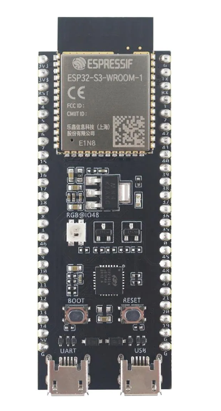

# ESP32_for_Arduino_Makers
ESP32 Projects using the Arduino IDE

## Summary
Learn about the ESP32 alternative to Arduino programming

Interfacing the ESP32 with:
* GPIOs
* Sensors
* Displays
* Motors
* Storage
* Time and date
* Wifi
* Bluetooth classic and Bluetooth Low Energy (BLE)

This repository follows the course path from: https://www.udemy.com/course/esp32-for-arduino-makers/

## Useful Links 
### User Guide
https://docs.espressif.com/projects/esp-idf/en/latest/esp32s3/hw-reference/esp32s3/user-guide-devkitc-1.html

### SoC models
https://www.espressif.com/en/products/socs

### Mouser.com (online shop)
https://ro.mouser.com/ProductDetail/356-EP32S3DVKTC1N8R8

## Contact
This repository is maintained by:
* George Calin
* george.calin [at] gmail.com
* Connect me on LinkedIn: https://www.linkedin.com/in/cgeorge1978/
